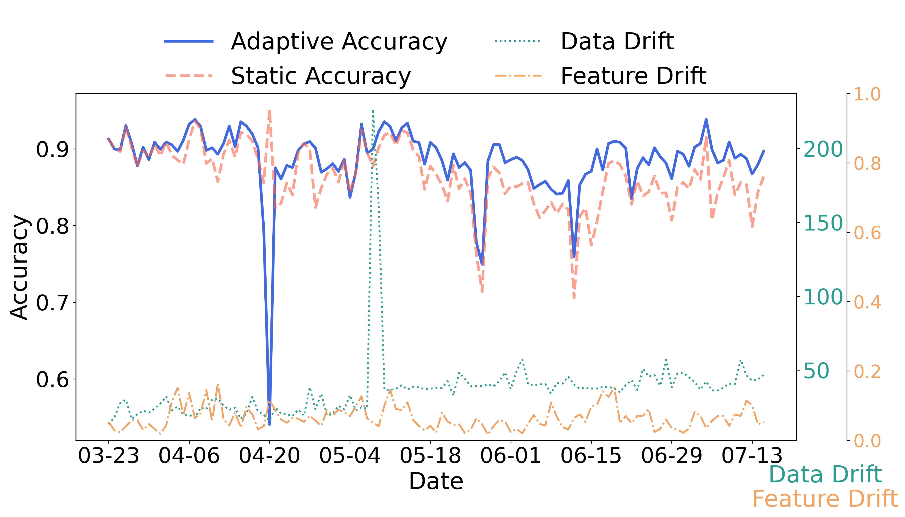
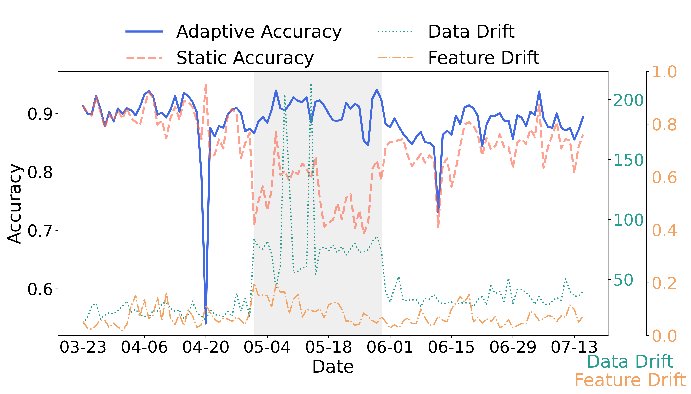
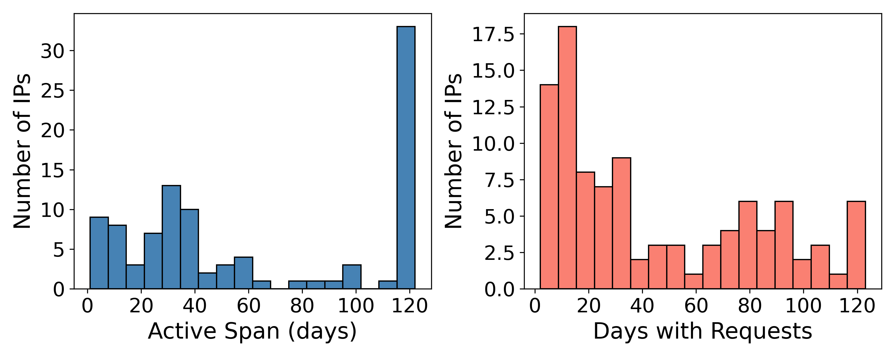
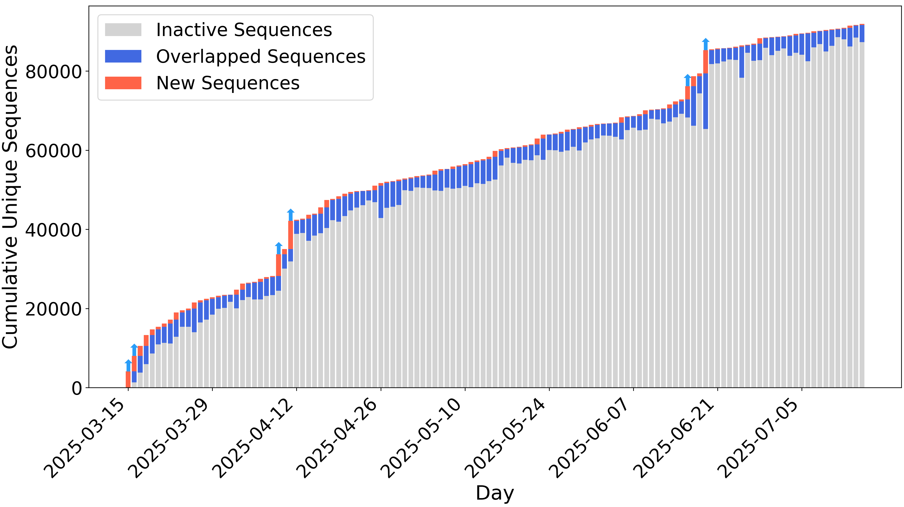

## LIVID: Drift-Driven Adaptive Intrusion Detection & Profiling
LIVID is a lightweight, adaptive intrusion detection and behavioral profiling framework for HTTP(S) traffic. It integrates layered real-world honeypot traffic collection, dual drift detection (statistical and trie-based), and adaptive machine learning to deliver robust, real-time detection of novel web attacks. LIVID also supports fine-grained behavioral profiling for advanced threat intelligence.

### Conda Environment
To reproduce the exact environment used in this project, use the conda environment:
```
conda livid create -f environment.yml
conda activate livid
```

## Key Features
- Layered architecture: Physical (data capture), virtual (adaptive detection), intelligence (behavioral profiling)
- Dual drift detection: Data drift (statistical) and feature drift (trie-based sequence modeling)
- Adaptive retraining: Model retraining triggered only by significant drift without full-scale retraining
- Behavioral profiling: User-agent grouping, escalation analysis, hierarchical taxonomy mapping

## Project Structure
```
LIVID/
├── physical/                    # data Query and Feature Engineering                 
├── virtual/
│   ├── adaptive.py              # main Script: adaptive detection with drift loop
|   └── static.py                # static detection
├── intelligence/                # behavior Profiling
│   ├── lowrate                 
│   ├── profile                 
│   └── uafp                     

======================= ↑ Core Components of LIVID================================================
├── measurement/                 # drift investigation
├── integration/                 # integration from a new source
│   ├── formatjson.py            # json -> csv
│   ├── feature.py               # feature engineering with new data
│   ├── adaptive.py              # adaptive detection
│   └── static.py                # static detection
└── comparison/                  # comparison with existing work

```

## Partial Results
<table>
  <tr>
    <td align="center">
      <br>
      <em>Model accuracy, drift, and unknown rate over time.</em>
    </td>
    <td align="center">
      <br>
      <em>Performance with new traffic. The shaded area indicates the integration of the internal honeypot.</em>
    </td>
  </tr>
  <tr>
    <td align="center">
      <br>
      <em>Cumulative request patterns for representative 5 IPs across different attacker behavioral categories.</em>
    </td>
    <td align="center">
      <br>
      <em>Evolution of unique HTTP sequence patterns</em>
    </td>
  </tr>
</table>

## Acknowledgement
